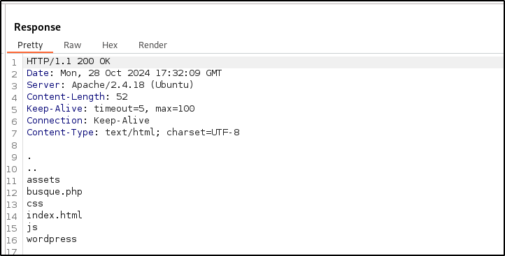
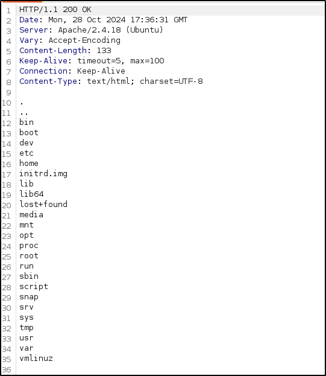
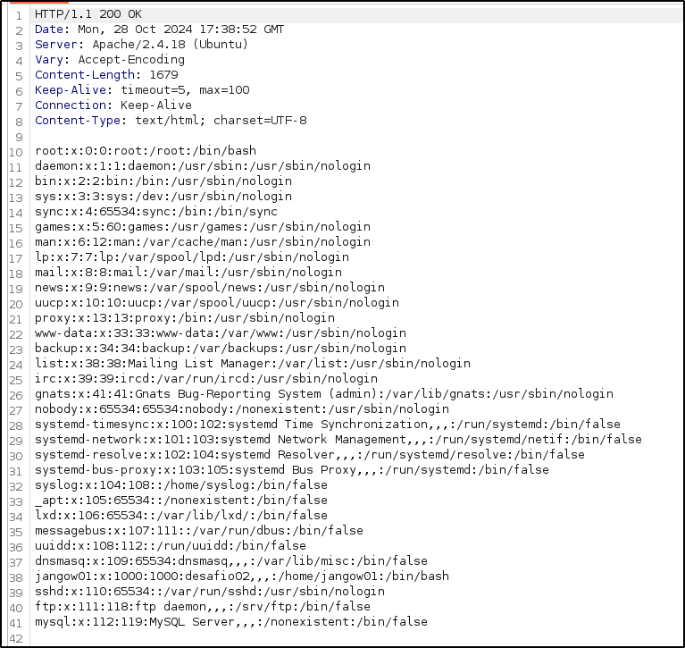
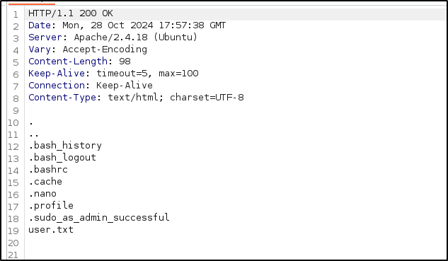
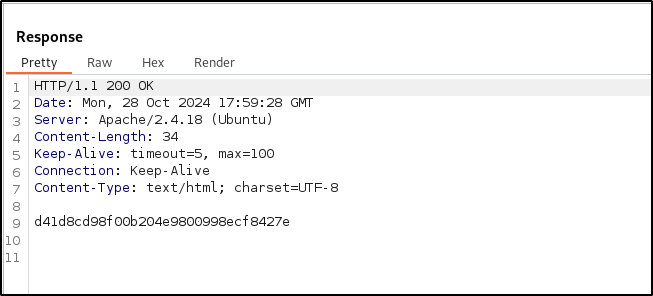
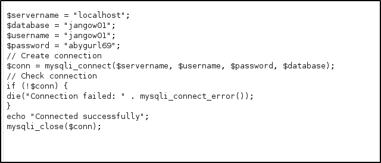
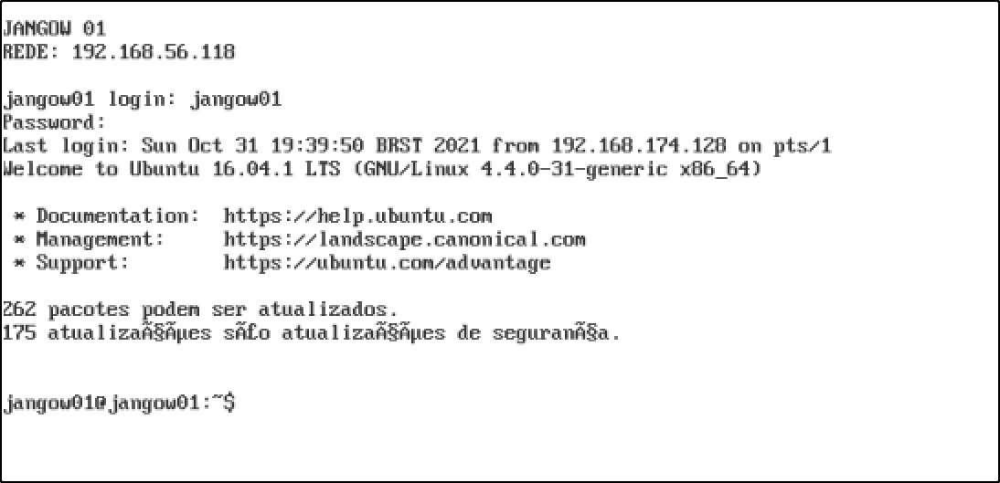

# Exploitation

Recap: 
1. There is a **remote authoriation bypass vulnerability**
2. There is a **local privilege escalation vulnerability**
3. I could see the UID, GID, and group for the web server (www-data)
4. the NVD showed several critical level vulnerabilities, which I'll look at now

CVE-2024-38476 has a description that looks promising:
> Vulnerability in core of Apache HTTP Server 2.4.59 and earlier are vulnerably to information disclosure, SSRF or local script execution via backend applications whose response headers are malicious or exploitable.

There is also CVE-2024-38474
> Substitution encoding issue in mod_rewrite in Apache HTTP Server 2.4.59 and earlier allows attacker to execute scripts in directories permitted by the configuration but not directly reachable by any URL or source disclosure of scripts meant to only to be executed as CGI.

For CVE-2024-38476, it lists vulnerability [CWE-829](https://cwe.mitre.org/data/definitions/829.html) as a culprit. The site says

>When including third-party functionality, such as a web widget, library, or other source of functionality, the product must effectively trust that functionality. Without sufficient protection mechanisms, the functionality could be malicious in nature (either by coming from an untrusted source, being spoofed, or being modified in transit from a trusted source). The functionality might also contain its own weaknesses, or grant access to additional functionality and state information that should be kept private to the base system, such as system state information, sensitive application data, or the DOM of a web application. 
This might lead to many different consequences depending on the included functionality, but some examples include injection of malware, information exposure by granting excessive privileges or permissions to the untrusted functionality, DOM-based XSS vulnerabilities, stealing user's cookies, or open redirect to malware

And I think, huh. There was a place in the web server where I could put input - the search ("busque") function. I might use burp and [Payloads All The Things](https://swisskyrepo.github.io/PayloadsAllTheThings/) to see if there is a PHP payload that executes something really useful. I'll use Burp, intercept `192.168.56.118/site/busque.php?buscar=id` and try sending something different, like

`192.168.56.118/site/busque.php?buscar=ls+-a`
And voila: 

I have access to the system. I'll snoop a bit.

`ls -a /`

OK, let's get the etc/passwd file:

Looks like the user is jangow01, but I already knew that from the login page. Password is hashed and salted... could try and brute force it? Or use privilege escalation to create a new user? I'll just snoop a bit more and look in jangow01's home directory

Well, that is interesting. Looking in user.txt:

This string, 'd41d8cd98f00b204e9800998ecf8427e' appears to be a MD5 hash, but running it against a few MD5 databases is showing me nothing - literally, it appears to be the hash of an empty string. However, I tested an empty string as the password and no dice.

I'll check the kernel version by running `uname -a`, and it is 4.4.0-32.
Unfortunately, because I don't have a remote shell and can't really make one because my machines are on an isolated network, I have to do everything in a single command. I can't create a file with vim or any other text editor; if I want to write to a file, I have to echo/print the lot.

However, the Apache server (www-data) is vulnerable to CVE-2019-0211, which may allow me to run a script (in PHP or similar) with root privileges. I've been going around and around for a little while now, so time to step back and think of a checklist to work through methodically rather than flailing.

1. Are there any processes that you have access to that run as root? (Try `ps -aux | grep root`)
2. Are there any files that you have write permissions for that are sensitive? (Unlikely as the www-data user, but check in case)
3. Does the sudo version have any known vulnerabilities that may allow it to be bypassed?
4. Are there any system or application configuration files that are badly configured? 
5. Are there any program or system logs you can look through for clues?
6. Is there any way to get a reverse shell without connecting the machines to the internet? Using a web server in Python, for instance?

Number one - nothing jumped out at me, except the root permissions on the /var/www/ folder, which is managed by www-data. I had a look inside, and found this:

which seems to contain a username and password for a mysql database. I tried the password for the mysql database, `abygurl69`, in the Jangow machine login and what do you know?

Unfortunately, the computer is expecting a different keyboard, perhaps a Spanish keyboard and won't work with my US-layout keyboard. Among other things, I can't type the character '/' which is vitally important - I can't type a '\\' either. One post on Google said that `SHIFT 7` should work, but it isn't for me, I just get the ampersand character. As fun as this was, I cannot go further without being able to type a forwardslash or backslash. Plus, everything is written in Portuguese (or maybe Spanish) and I can only make out bits of meaning. The commands also seem to be different to standard Linux - the computer didn't recognise the `whoami` command, it threw an error.

# Summary

I got into the computer over the network via an insecure web server. Once in, I was able to access the mysql records which contained the password for the jangow01 user. I was unable to continue due to hardware errors.