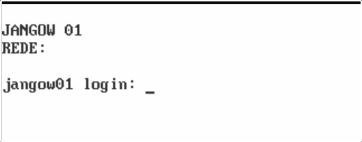
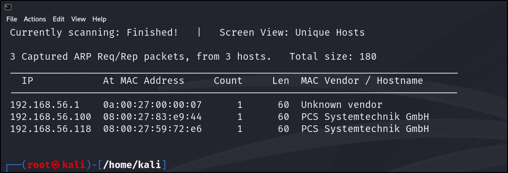

# VULNHUB: JANGOW v 1.0.1

Initial information provided by the creator of the machine:
- DHCP enabled
- IP address not given, automatically assigned
- Hint given: "The secret is enumeration"

The initial screen shown on startup of Jangow machine is a command line login, shown here:

First I want to find out the IP address, so I'll run 

`arp-scan -l` 

first to discover what range to look in. I am given addresses in the range 192.168.56.0/24.

`netconfig -r 192.168.56.0/24`

Run `ifconfig` to see the address of my Kali machine it is the 192.168.56.100 address - which means the JANGOW machine is 192.168.56.118

Next thing I'll do is [scan](scans.md)

