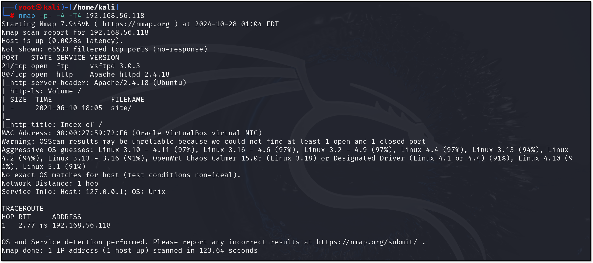
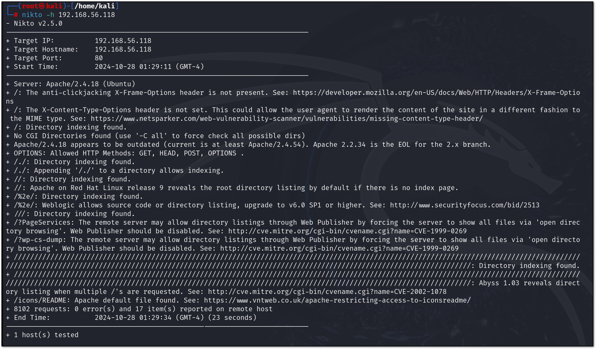
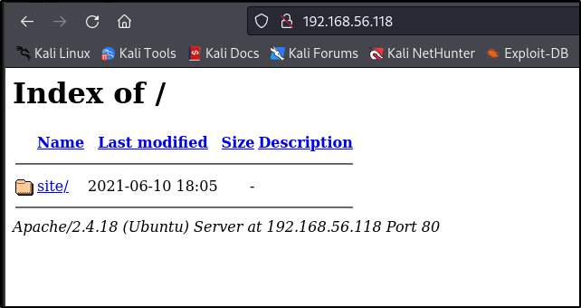
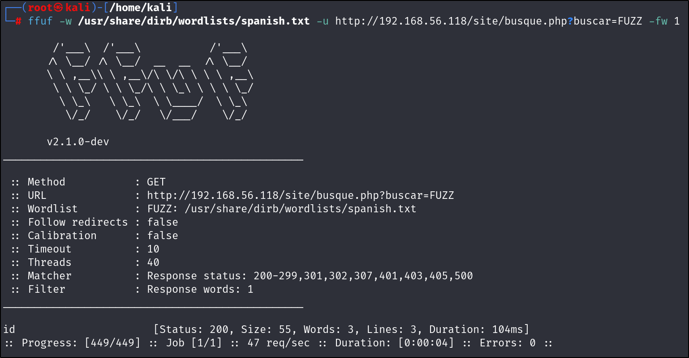
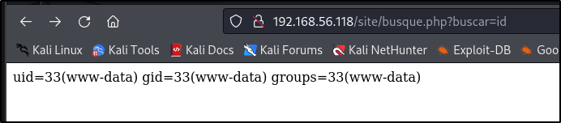

# Scanning

Running nmap on all ports with quite an aggressive scan (because this is a local machine and I don't need to worry about disrupting anyone):

`nmap -p- -A -T4 192.168.56.118`

Port 80 (http) is promising as it is often highly exploitable, but port 21 (FTP - file transfer) could also be a vulnerable point depending on how it is being managed. I'll look at FTP first
`vsftpd 3.0.3`
Unfortuntely, the only exploit apparant is a denial of service attack, found on [exploit DB](https://www.exploit-db.com/exploits/49719)

Moving onto the port 80:
`Apache httpd 2.4.18`
so the web server seems to be Apache 2.4.18

Searching for any known vulnerabilties, and there are a couple. One is a [local privilege escalation](https://www.exploit-db.com/exploits/46676), which I'll file away for later. One is a [remote authorisation bypass](https://cve.mitre.org/cgi-bin/cvename.cgi?name=CVE-2016-4979), which is very interesting indeed. It could be one could use these together: gain access using the remote authorisation bypass, then escalate privileges?

Finally, I looked at the [National Vulnerability Database](https://nvd.nist.gov/vuln/search/results?form_type=Advanced&cves=on&cpe_version=cpe:/a:apache:http_server:2.4.18) which showed several critical vulnerabilties

I'm going to quickly use Nikto too to scan for additional vulnerabilties. Nikto does not work on most modern systems, but might work on a VulnHub machine, so:

One interesting part is here: `appending '/./' to a directory listing allows indexing`. I'll look at that. Navigating to 192.168.56.118/./ reveals:

It reveals a page for a Bootstrap theme called Grayscale. There is a menu option titled "Buscar", which produces a URL of
`192.168.56.118/site/busque.php?buscar=`
and renders a blank page, which is interesting. "Busque" is Spanish for "Search", and "Buscar" is Spanish for "to go fetch/restrieve". I might be going down a rabbit hole, but I'll just do a quick fuzz for random terms

`ffuf -w /usr/share/dirb/wordlists/spanish.txt -u 192.168.56.118/site/busque.php?buscar=FUZZ`

And after filtering out the most common wordcount (1) we have a winner.

Going to the browser and rendering it, we see the IDs of the web server. Maybe not a rabbit hole, then? I seem to be able to execute Linux commands and get a response from the server via this webpage.

Time to move onto [exploitation](exploitation.md)